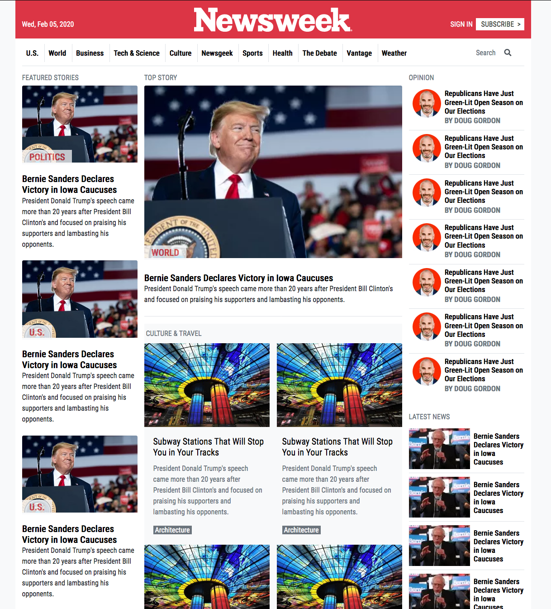

Newsweek.com

> Recreating the Newsweek homepage.

The Newsweek homepage was recreated as a demonstration of the use of bootstrap.

## Built With

- HMTL5,
- CSS3,
- Bootstrap 4

## Live Demo

[Live Demo Link](https://raw.githack.com/paulo-techie/newsweek-bootstrap/main-feature/index.html)

## Getting Started

To get a local copy up and running follow these simple example steps.

### Make sure you have computer with running versions of Mozilla Firefox, Google Chrome, Internet Explorer or Edge browsers or similar/compatible.

### Copy all the files into a local folder on your computer.

### Run index.html 

## Author

👤 Paul Omondi

- Github: [@paulo-techie](https://github.com/paulo-techie)
- Linkedin: [Paul Omondi](https://www.linkedin.com/in/paul-o-43051a31/)

## 🤝 Contributing

Contributions, issues and feature requests are welcome!

Feel free to check the [issues page](issues/).

## Show your support

Give a ⭐️ if you like this project!

## Acknowledgments

- Special thanks to Microverse.

## 📝 License

This project is [MIT](lic.url) licensed.
